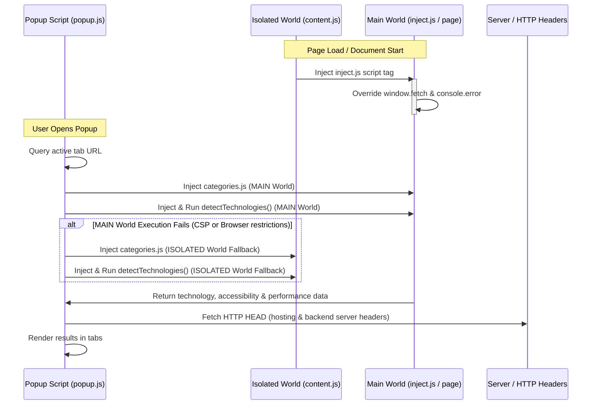

# System Integrations & Injection Flows - StackRay

StackRay relies on a dual-world injection architecture to inspect the page DOM, read window globals, intercept network calls, and query resource headers.

## 1. Page World Separation
Chrome Extensions execute scripts in two main contexts:
1. **Isolated World (Content Scripts)**: Has direct access to the page DOM, but is isolated from the page's execution scope (cannot read `window` globals defined by page scripts, and page scripts cannot read the extension's variables).
2. **Main World (Page Scope)**: Executes in the same scope as standard page scripts. It can read page variables, modify `window` prototypes, and access page-specific JS frameworks (e.g. `window.React`).

## 2. Injection Channels
- **Injected Script (`inject.js`)**: Injected via a dynamic script tag inside `content.js` at `document_start`. It modifies `window.fetch` and `console.error` to collect diagnostics in `window._stackXRay_Net` in the page scope.
- **Scripting API Injection (`categories.js` & `detectTechnologies()`)**: Executed from `popup.js` using `chrome.scripting.executeScript`. Attempts to run in `world: "MAIN"` to query page-level global variables. If blocked by Content Security Policy (CSP), falls back to the default `ISOLATED` world execution.

## 3. Network Discovery
- Intercepts `window.fetch` calls inside the page context to log requests.
- Checks request body contents for GraphQL operations (queries and mutations).
- Executes an out-of-band `fetch` HEAD request to the origin URL to inspect headers (like `server`, `x-powered-by`, `x-vercel-id`, `x-nf-request-id`, `cf-ray`) to identify hosts (Vercel, Netlify, Cloudflare) and web servers (Nginx, Apache).
