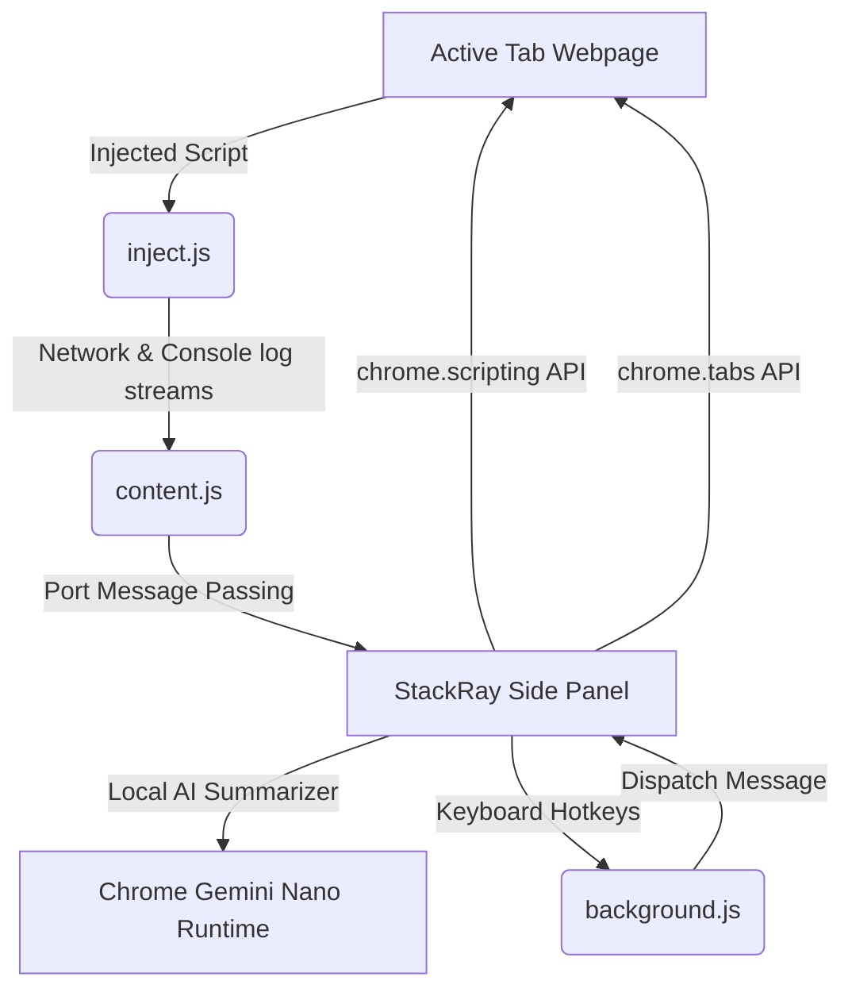

# StackRay ── High-Performance Site Profiler & Local AI Analyst

> A premium, high-contrast, minimalist Manifest V3 Chrome Extension designed for deep-dive page profiling. Inspect technologies, analyze design systems in real-time, simulate social cards, chart network timings, capture console logs, and run local Gemini Nano AI summaries ── 100% privately.

---

## ⚡ 15 Core Tabs & Feature Details

StackRay is structured into **15 visual panels**, each providing specialized web intelligence:

### 1. 🛠️ Tech Stack Detector
* **Tech Scans**: Matches script names, global variables, and CDN signatures against **15 categories** of technologies (React, NextJS, Vue, Tailwind, WooCommerce, Squarespace, Wix, Google Analytics, Firebase, etc.).
* **Vanilla Stack Fallback**: If no frontend framework or CMS is detected, the extension automatically applies a premium **"Vanilla Stack"** label, verifying pure HTML5/CSS3/JS setups.
* **CSP Bypass**: Employs declarative main-world content scripts to safely detect page parameters without violating strict Content Security Policies (CSP) on pages like Google Search and GitHub.

### 2. 🎨 Design System Specs
* **Color Palette Spec**: Extracts all dominant hex colors used on the active document and aligns them in a clickable hex-copy grid.
* **Typography & Fonts**: Audits declared font families and font weights.
* **Hover Design Inspector**: Activates a custom magnetic mouse cursor overlay that tracks element boundaries and shows computed styles (padding, margin, fonts, colors, border radius) on hover with a 1-click clipboard copy.

### 3. 🔍 SEO & Social Sim
* **SEO Quality Checklist**: Audits title tags, description, robots indexing meta, canonical declarations, and favicon availability.
* **Social Preview Cards**: Generates live responsive mockups of how the page will look when shared as a search snippet or social post card on:
  * **Google Search Results** (desktop layout).
  * **LinkedIn Post Feed** (illustrative thumbnail card).
  * **X (formerly Twitter) Timeline** (large summary card format).

### 4. 🏷️ Keywords & Density
* **Keyword Frequency Distribution**: Analyzes textual nodes, filters out common stop-words, and lists top keywords sorted by density percentage with a 1-click copy handler.
* **Reading Statistics**: Calculates total word count and estimated reading time based on typical reading speeds.

### 5. ⏱️ Perf (Core Web Vitals)
* **On-Page Core Metrics**: Visual progress speedometer bars for **FCP (First Contentful Paint)**, **LCP (Largest Contentful Paint)**, and **CLS (Cumulative Layout Shift)**.
* **Resource Waterfalls**: Maps exact millisecond durations for DNS lookup, TCP handshakes, TLS setup, TTFB (time to first byte), and DOM load completeness.

### 6. ♿ Accessibility (A11y)
* **Contrast & Tag Auditing**: Scans the page for accessibility violations, checking image `alt` attributes, matching form labels, and checking ARIA configurations.
* **Colorblind Deuteranopia Simulation**: Injects a custom visual filter to simulate Deuteranopia (red-green colorblindness) across the viewport.

### 7. 🕸️ Network Interceptor (`Net`)
* **Live Network Streams**: Intercepts XMLHttpRequests (XHR) and Fetch API calls, logging request URLs, status codes, methods, and sizes in real-time.
* **Console Logs Interceptor**: Captures Javascript errors, uncaught exceptions, and console warning streams directly in the sidebar's dark retro log shell.

### 8. 👣 Contact & Micro Leads
* **Contact Scraper**: Scans elements for `mailto:`, `tel:`, and social platform links (Facebook, Instagram, GitHub, LinkedIn, X, YouTube, and WhatsApp).
* **Corporate Footprints**: Automatically identifies standard pages (e.g. `About Us`, `Contact`, `Privacy Policy`, `Pricing`, `Login`) to build a footprint map.

### 9. 🌐 Domain Hosting & WHOIS
* **ASN & Hosting Lookup**: Performs secure HTTPS hosting queries using **[ipapi.co](https://ipapi.co/)** to fetch hosting ISP, server location coordinates, country, and ASN.
* **WHOIS Domain Queries**: Utilizes the public **[rdap.org](https://rdap.org/)** registry endpoint to parse registrar names, registration creation, and expiration dates.

### 10. 🛡️ Security Vulnerabilities
* **SSL Protocol Checker**: Displays active connection safety levels.
* **Security Headers Audit**: Queries site response headers for **CSP**, **HSTS**, **X-Frame-Options** (Clickjacking protection), and **X-Content-Type-Options**.
* **Host Cookies Audit**: Pulls active host cookies using `chrome.cookies.getAll` and validates if **Secure**, **HttpOnly**, and **SameSite** configuration flags are present.
* **DOM Security Scan**: Flags insecure HTTP form submission endpoints (`action="http://..."`) and links targetting `_blank` that lack `rel="noopener"`.

### 11. 🖼️ Media Explorer
* **Assets Gallery**: Scrapes all inline images, stylesheets background-images, and serialized vector `<svg>` code.
* **Dimensions & File Type Specs**: Displays asset previews in a checklist thumbnail grid with sizes, dimensions, and type badges.
* **Bulk Asset Downloader**: Lets developers select specific images and download them concurrently as local file blobs.

### 12. 📦 Sandbox Utils
* **JWT Decoder**: Paste a JSON Web Token to instantly split and parse its JSON header and payload structures.
* **JSON Formatter**: Clean **Beautify** (indent-2 spacing) and **Minify** functions.
* **Base64 Converter**: Text string encoder and decoder.
* **Regex Matcher**: Test matching parameters against regular expressions to inspect offset offsets.
* **Hash Generator**: Real-time SHA-256 and SHA-1 hash strings generator using the browser's native Web Crypto API.

### 13. 🧠 Local AI Summarizer (Gemini Nano)
* **On-Device Summaries**: Leverages Chrome's on-device prompt engine to summarize page content without external API requests.
* **Formatting Modes**: Formats text outputs into **Key Points**, **TL;DR**, **Teasers**, or **Headlines**, with lengths adjustable to **Short**, **Medium**, or **Long**.

### 14. 🛠️ DevTools Suite (50+ Utilities)
Includes **50 diagnostic actions** and a **Live CSS Injector** text area:
* **Design & Styling (12)**: Page Editor, Design Inspector, Color Picker, Wireframe Mode, Flex/Grid Highlight, Outline Absolute, Invert Colors, CSS Inline Spotter, CSS Variables, Disable CSS, Disable Tailwind, Kill Transitions.
* **Storage & Scripts (4)**: Wipe Storage, View Cookies, Clean Scripts, Strip URL Params.
* **SEO, Performance & Audits (13)**: DOM Diagnostics, JSON-LD Schema, Meta Tags Viewer, Broken Link Check, Performance Time, Resource Counter, ID Elements, CSS Class List, Heading Outline, Lang & Encoding, Alt Inspector, HTTP Finder, WCAG Contrast Audit.
* **Accessibility & Forms (7)**: Colorblind Sim (Deuteranopia filter), Label Inspector, Show Hidden, Editable DOM, Mock Form Filler, Show Passwords, Broken Images.
* **Extractors & Clipboard (7)**: Copy Links, Copy Images, Copy Emails, Font Viewer, Extract SVGs, Table to CSV, Iframe Auditing.
* **System & Viewport Helpers (7)**: User-Agent, Viewport Size, Hard Reload, Capture Screenshot, Print Page, Scroll Top, Scroll Bottom.

### 15. 📥 Report & Export
* **JSON Export**: Downloads all accumulated profiling information as a single formatted JSON.
* **CSV Export**: Downloads table breakdowns of technology parameters, headers, and media details.
* **Data Selection**: Checkbox selectors let you exclude specific categories (e.g. Leads data, Network console log history) before downloading.

---

## 📐 Architecture & Flow

---

## 🧠 On-Device AI Summarizer Setup (Gemini Nano)

To utilize the **AI Summary** tab, you need to enable Chrome's local AI model components. Copy and paste the following flags into your URL bar:

1. **Enable On-Device Model**:
   - Go to: `chrome://flags/#optimization-guide-on-device-model`
   - Set to: **Enabled BypassPerfRequirement**
2. **Enable Prompt API**:
   - Go to: `chrome://flags/#prompt-api-for-gemini-nano`
   - Set to: **Enabled**
3. **Verify Download**:
   - Relaunch Chrome.
   - Go to `chrome://components` and find **Optimization Guide On-Device Model**. Ensure it is fully updated and downloaded.

---

## 🚀 Quick Installation Steps

1. **Download/Clone** this repository to your local machine.
2. Open Google Chrome and navigate to **`chrome://extensions/`**.
3. Toggle on **Developer mode** in the top-right corner.
4. Click **Load unpacked** in the top-left corner.
5. Select the folder containing this extension (`Chrome Extention` root folder).
6. Click the Extensions puzzle piece icon, pin **StackRay**, and press **`Ctrl+Shift+Y`** (Mac: **`Cmd+Shift+Y`**) to open it!

---

## ⌨️ Keyboard Shortcuts Reference

| Shortcut Binding | Action Performed | Scope |
| :--- | :--- | :--- |
| `Ctrl+Shift+Y` (Mac: `Cmd+Shift+Y`) | **Toggle StackRay Side Panel** | Global Browser |
| `Ctrl+Shift+E` (Mac: `Cmd+Shift+E`) | **Export Profiling Data as JSON** | Extension Panel Active |

---

## 👨‍💻 Credits & Socials

Designed, built, and optimized by **Zain Ali Mughal**. 

* **GitHub**: [@usernamezain](https://github.com/usernamezain)
* **LinkedIn**: [Zain Ali Mughal](https://www.linkedin.com/in/zainali-mughal/)

✨ **Join for more exclusive drops (Portfolio templates, updates, and templates)**:
👉 **[Join Zain's WhatsApp Drops Channel](https://whatsapp.com/channel/0029VbBUVv35fM5eAnXw3w2D)**

---

*StackRay is client-side only. Your analyzed content never leaves your browser.*

*Created for developers by a developer.*