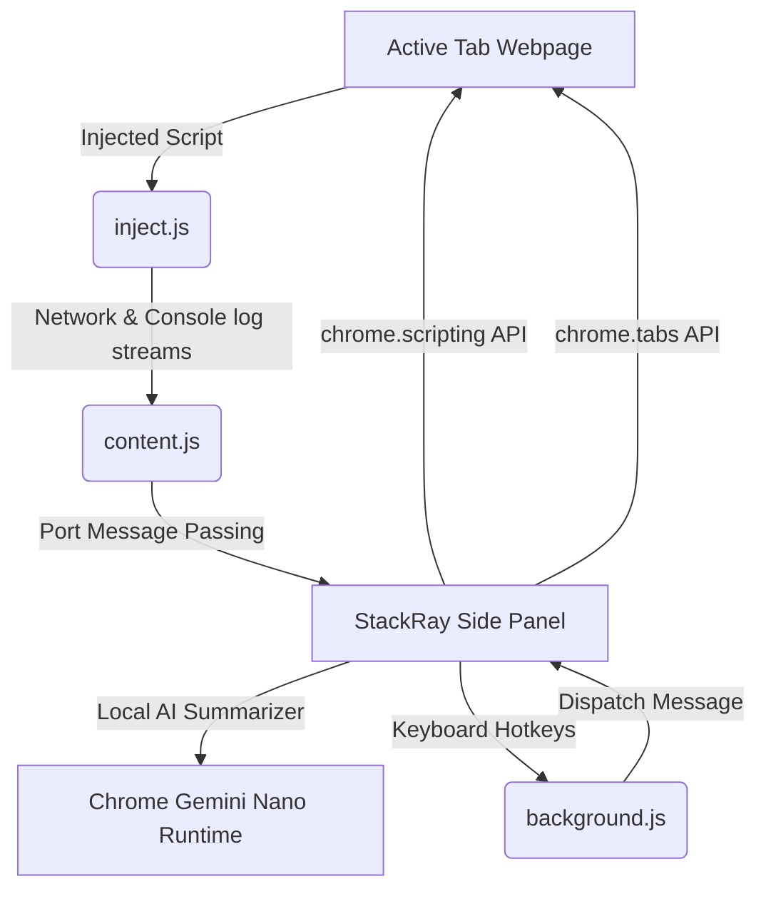

# StackRay ── High-Performance Site Profiler & Local AI Analyst

> A premium, high-contrast, minimalist Manifest V3 Chrome Extension designed for deep-dive page profiling. Inspect technologies, analyze design systems in real-time, simulate social cards, chart network timings, capture console logs, and run local Gemini Nano AI summaries ── 100% privately.

---

## ⚡ Core Features at a Glance

| Feature Module | Capabilities | Developer Value |
| :--- | :--- | :--- |
| **🛠️ Tech Stack Detector** | Analyzes scripts, CDNs, packages, headers, and platforms (React, NextJS, Cloudflare, etc.). | Instantly map site building blocks and third-party modules. |
| **🎨 Design System specs** | Live color grids, typographical families, radius specs, margins, paddings, and **Hover Inspector Mode**. | Extract styling patterns and copy CSS properties to your clipboard. |
| **🧠 Local Gemini Nano AI** | Built-in text summarization, offering Key Points, TL;DRs, Teasers, and Headlines. | Privacy-first summarization that works offline with zero API cost. |
| **📊 Performance Metrics** | Measures Core Web Vitals (LCP, FCP, CLS) alongside a **Navigation timing waterfall**. | Identify network bottlenecks (DNS, TCP, TTFB, DOM Interactive). |
| **🔍 SEO & Social Sim** | Detailed SEO audits, canonical checks, keyword densities, and **Live Google/LinkedIn/X preview cards**. | Preview how metadata matches look when shared across social channels. |
| **🖥️ Console Terminal** | Custom retro command-line log feed (Info, Warnings, Errors) running in the side panel. | Intercept and scan site health issues without opening DevTools. |
| **👣 Micro Leads Hunt** | Scrape support emails, tel parameters, socials profiles, and about/contact pages. | Surface client contact information instantly. |

---

## 📐 Architecture & Flow

---

## 🛠️ On-Device AI Summarizer Setup (Gemini Nano)

To utilize the **AI Summary** tab, you need to enable Chrome's local AI model components. Copy and paste the following flags into your URL bar:

1. **Enable On-Device Model**:
   - Go to: `chrome://flags/#optimization-guide-on-device-model`
   - Set to: **Enabled BypassPerfRequirement**
2. **Enable Prompt API**:
   - Go to: `chrome://flags/#prompt-api-for-gemini-nano`
   - Set to: **Enabled**
3. **Verify Download**:
   - Relaunch Chrome.
   - Go to `chrome://components` and find **Optimization Guide On-Device Model**. Ensure it is fully updated and downloaded.

---

## 🚀 Quick Installation Steps

1. **Download/Clone** this repository to your local machine.
2. Open Google Chrome and navigate to **`chrome://extensions/`**.
3. Toggle on **Developer mode** in the top-right corner.
4. Click **Load unpacked** in the top-left corner.
5. Select the folder containing this extension (`Chrome Extention` root folder).
6. Click the Extensions puzzle piece icon, pin **StackRay**, and press **`Ctrl+Shift+Y`** (Mac: **`Cmd+Shift+Y`**) to open it!

---

## ⌨️ Keyboard Shortcuts Reference

| Shortcut Binding | Action Performed | Scope |
| :--- | :--- | :--- |
| `Ctrl+Shift+Y` (Mac: `Cmd+Shift+Y`) | **Toggle StackRay Side Panel** | Global Browser |
| `Ctrl+Shift+E` (Mac: `Cmd+Shift+E`) | **Export Profiling Data as JSON** | Extension Panel Active |

---

## 👨‍💻 Credits & Socials

Designed, built, and optimized by **Zain Ali Mughal**. 

* **GitHub**: [@usernamezain](https://github.com/usernamezain)
* **LinkedIn**: [Zain Ali Mughal](https://www.linkedin.com/in/zainali-mughal/)

✨ **Join for more exclusive drops (Portfolio templates, updates, and templates)**:
👉 **[Join Zain's WhatsApp Drops Channel](https://whatsapp.com/channel/0029VbBUVv35fM5eAnXw3w2D)**

---

*StackRay is client-side only. Your analyzed content never leaves your browser.*
